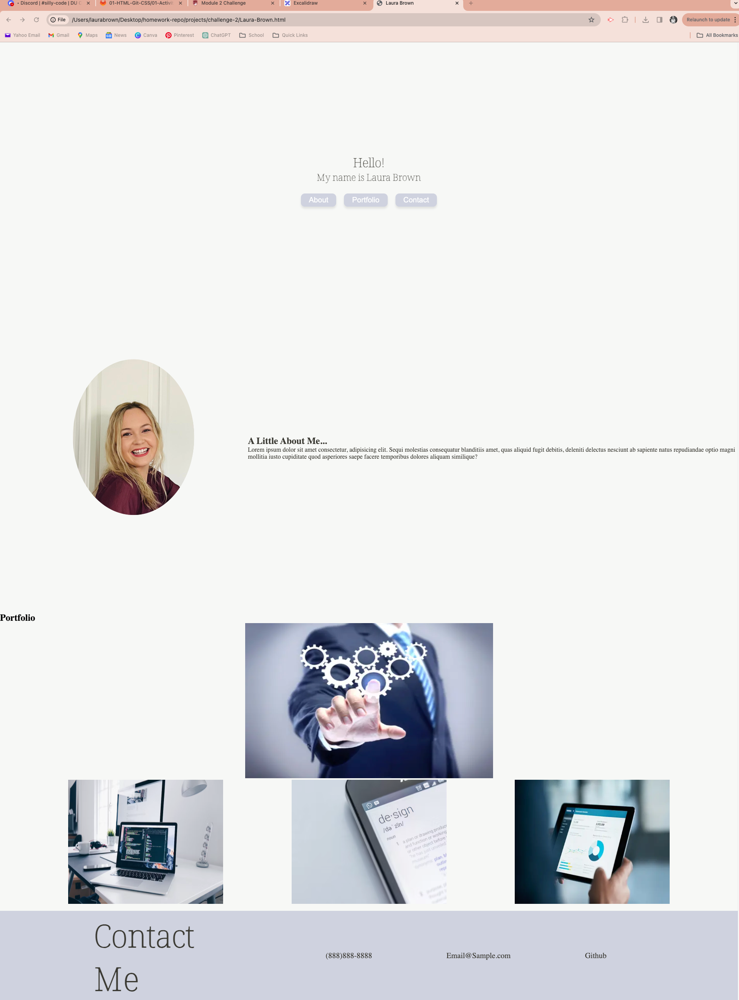

# Challenge-2

Deploy:

This site is a portfolio for Laura Brown. When the page is loaded you are presented with the developers name and nav links in the form of buttons to navigate to different sections within the site.

When you click on any of the links, the ui scrolls to that section.

When you scroll to the about section you are presented with a photo of the developer and a small paragraph about her.

When you scroll to the portoflio section you are greeted with several exampls of work. Each one has a link. The first project is the largest.

When you resize the page, the layout turns to a flex box column display.

Wireframe:
Assets/wireframe-1st-portfolio.excalidraw

Screenshot:

Acceptance Critieria: 
GIVEN I need to sample a potential employee's previous work

WHEN I load their portfolio THEN I am presented with the developer's name, a recent photo or avatar, and links to sections about them, their work, and how to contact them

WHEN I click one of the links in the navigation THEN the UI scrolls to the corresponding section

WHEN I click on the link to the section about their work THEN the UI scrolls to a section with titled images of the developer's applications

WHEN I am presented with the developer's first application THEN that application's image should be larger in size than the others

WHEN I click on the images of the applications THEN I am taken to that deployed application

WHEN I resize the page or view the site on various screens and devices THEN I am presented with a responsive layout that adapts to my viewport